# OpenTG Admin

OpenTG Admin 是一个面向 Telegram 生态的后台管理界面，用于集中管理频道、群组、机器人、搜索源、用户、关键词和运营记录。

它适合用于 Telegram 内容发现、资源聚合、搜索运营、用户管理和基础审核场景，也可以作为中小型工具类产品的后台界面参考。

## 功能特性

- 数据概览：展示访问量、用户数、资源数、搜索量等核心指标
- 资源管理：支持频道、群组、机器人和搜索工具等资源视图
- 视频源管理：用于维护采集源、状态、分类和最近同步信息
- 用户管理：包含用户列表、活跃记录、推荐返佣和提现审核
- 搜索运营：提供搜索记录、热搜词、过滤词和搜索调参页面
- 分类标签：支持分类、标签和资源状态的统一管理
- 后台布局：包含侧边栏导航、顶部栏、卡片、表格、筛选和详情面板
- 视觉风格：简洁、清晰，适合运营人员高频使用

## 适用场景

- Telegram 频道/群组导航后台
- Telegram 搜索或资源聚合产品
- 内容源审核与运营管理系统
- SaaS 后台管理界面参考
- 个人开源项目或产品原型展示

## 项目结构

```text
.
├── mock-open-source-admin.html
└── README.md
```

## 快速开始

使用浏览器打开 `mock-open-source-admin.html` 即可查看界面。

无需额外配置后端服务。

## 页面模块

后台包含以下页面模块：

- 总览
- 频道 / 群组 / 机器人
- 搜索工具
- 视频采集源
- 热搜词
- 用户管理
- 搜索记录
- 推荐返佣
- 提现请求
- 签到记录
- 前台过滤词
- 搜索调参
- 分类管理
- Tags 管理

## 自定义

你可以根据自己的项目需求调整：

- 菜单名称和页面模块
- 表格字段和数据结构
- 品牌名称、配色和布局
- 指标卡片和图表内容
- 操作按钮和状态类型

## 技术栈

- HTML
- CSS
- JavaScript

## 开源协议

MIT
<p align="center">
  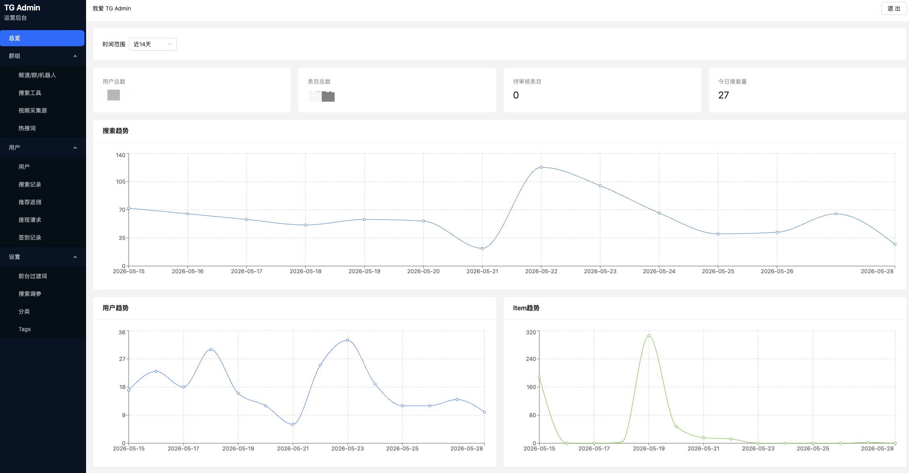
</p>
<hr style="margin:40px 0;">
<p align="center">
  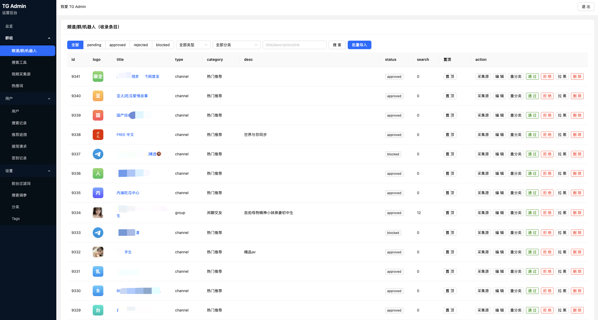
</p>
<hr style="margin:40px 0;">
<p align="center">
  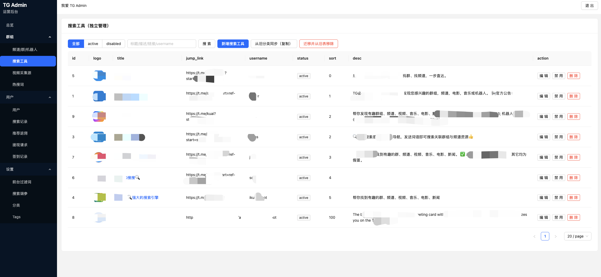
</p>
<hr style="margin:40px 0;">
<p align="center">
  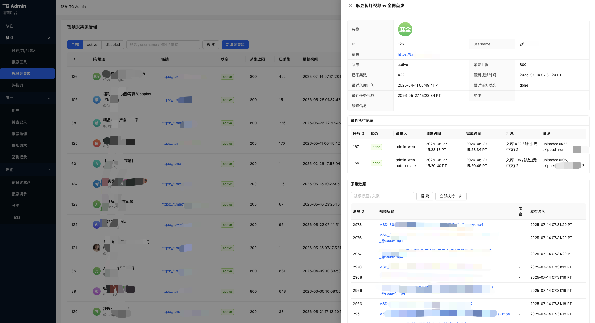
</p>
<hr style="margin:40px 0;">
<p align="center">
  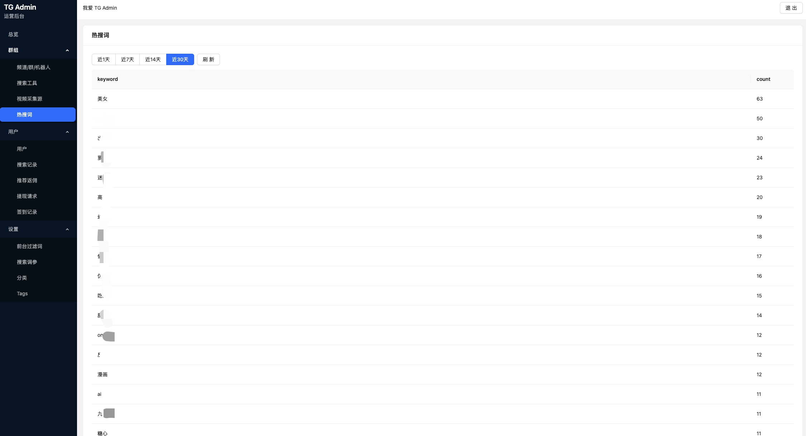
</p>
<hr style="margin:40px 0;">
<p align="center">
  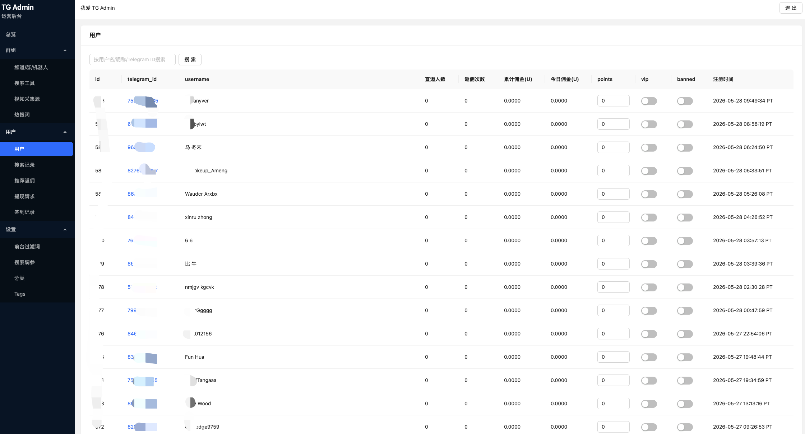
</p>
<hr style="margin:40px 0;">
<p align="center">
  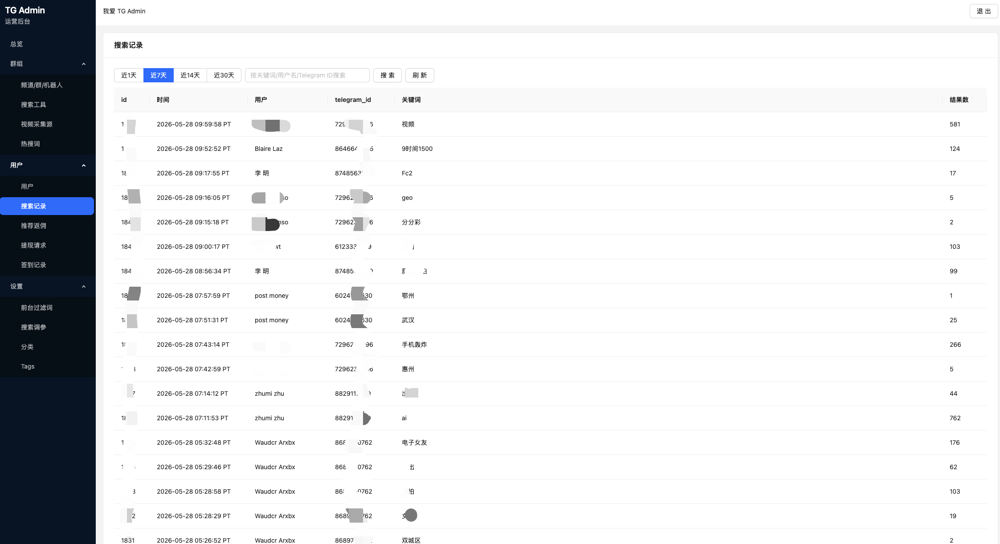
</p>
<hr style="margin:40px 0;">
<p align="center">
  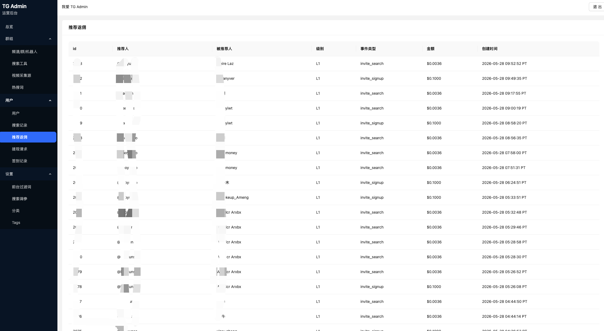
</p>
<hr style="margin:40px 0;">
<p align="center">
  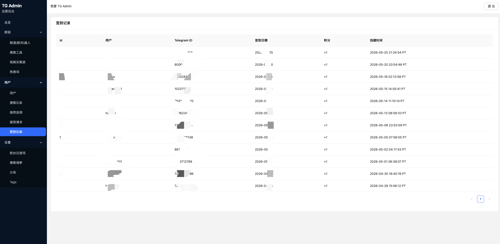
</p>
<hr style="margin:40px 0;">
<p align="center">
  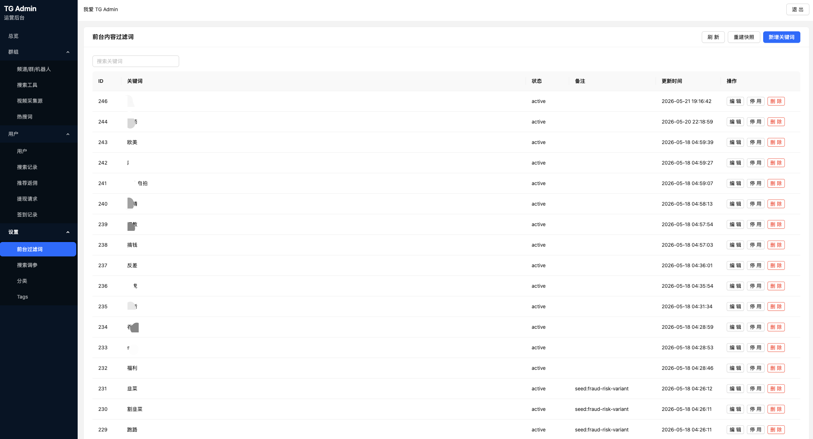
</p>
<hr style="margin:40px 0;">
<p align="center">
  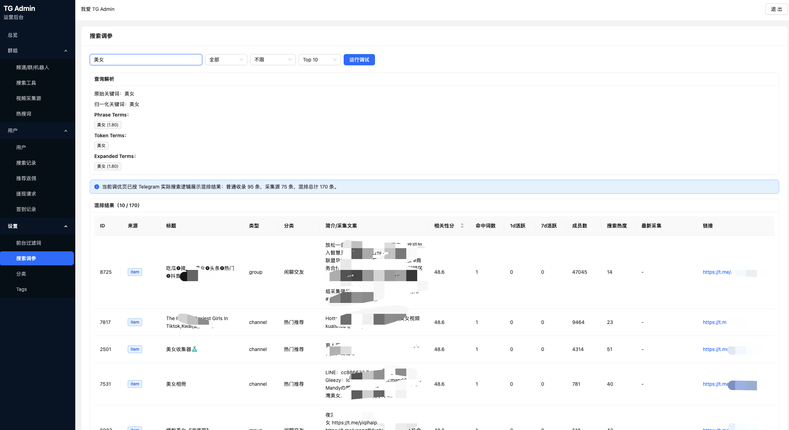
</p>
<hr style="margin:40px 0;">
<p align="center">
  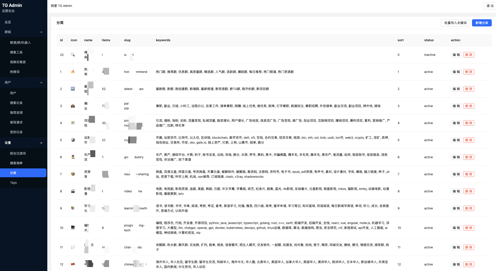
</p>
<hr style="margin:40px 0;">
<p align="center">
  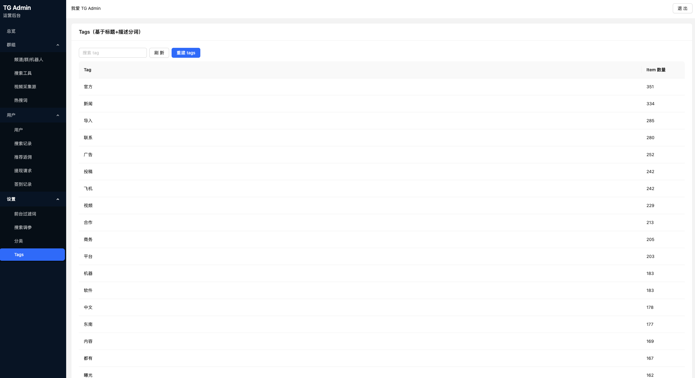
</p>

